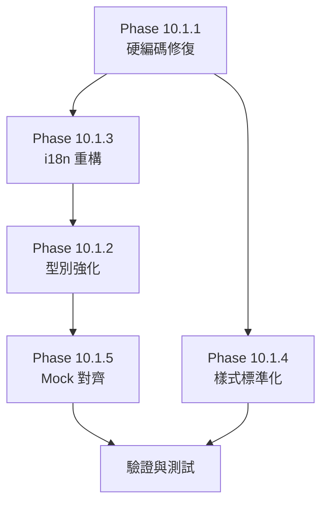

# Phase 10.1 階段性修正與優化計畫

> **基準文件**：`QA_Phase 10.0_REPORT.md`
> **計畫日期**：2026-01-23
> **目標**：系統性修復所有 QA 協議違規，並建立可維護的多語系架構

---

## 🎯 修正目標總覽

| 階段 | 目標 | 預估工時 | 優先級 |
|------|------|----------|--------|
| **10.1.1** | 硬編碼文字修復 (Hardcoded Text) | 2-3 小時 | P0 |
| **10.1.2** | TypeScript 型別強化 | 2-3 小時 | P1 |
| **10.1.3** | 多語系架構重構 (i18n Refactor) | 3-4 小時 | P1 |
| **10.1.4** | 內聯樣式標準化 | 1-2 小時 | P2 |
| **10.1.5** | Mock 資料型別對齊 | 1-2 小時 | P2 |

---

## 📋 Phase 10.1.1 — 硬編碼文字修復

### 目標

將所有硬編碼中文字串移至 i18n 語系檔，確保 UI 文字集中管理。

### 修復清單

#### A. `src/views/Merchant/Finance/MyInvoices.vue` (15 項)

| 行號 | 原始內容 | 目標 i18n Key |
|------|----------|---------------|
| L56 | `折合約 ${usdt} USDT` | `invoices.usdtConversion` |
| L176 | `請輸入有效金額` | `validation.invalidAmount` |
| L193 | `提交失敗` | `common.submitFailed` |
| L201 | `請輸入交易序號` | `validation.txidRequired` |
| L224 | `提交失敗` | `common.submitFailed` |
| L232 | `請輸入有效額度` | `validation.invalidLimit` |
| L254 | `提交失敗` | `common.submitFailed` |
| L346 | `請輸入交易序號` | `invoices.txidPlaceholder` |
| L349 | `取消` | `common.cancel` (已存在) |
| L367 | `請輸入區塊鏈交易序號` | `invoices.blockchainTxidPlaceholder` |
| L370 | `上傳圖片 (模擬)` | `invoices.uploadImageMock` |
| L373 | `取消` | `common.cancel` |
| L388 | `請說明調額理由` | `invoices.creditReasonPlaceholder` |
| L391 | `取消` | `common.cancel` |

#### B. `src/views/Merchant/Dashboard/Index.vue` (1 項)

| 行號 | 原始內容 | 目標 i18n Key |
|------|----------|---------------|
| L43 | `前往處理` | `merchantDashboard.processAlert` |

#### C. `src/views/Master/Merchant/Configuration.vue` (12 項)

| 行號 | 原始內容 | 目標 i18n Key |
|------|----------|---------------|
| L41 | `警告：重置密鑰` | `merchantConfig.dialog.resetSecretTitle` |
| L42 | `這將導致當前商戶的 API...` | `merchantConfig.dialog.resetSecretContent` |
| L43 | `確定重置` | `merchantConfig.dialog.confirmReset` |
| L44 | `取消` | `common.cancel` |
| L62 | `警告：切換錢包模式` | `merchantConfig.dialog.walletModeTitle` |
| L63 | `切換錢包模式可能導致...` | `merchantConfig.dialog.walletModeContent` |
| L64 | `確認切換` | `merchantConfig.dialog.confirmSwitch` |
| L65 | `取消` | `common.cancel` |
| L77 | `安全性警告` | `merchantConfig.dialog.securityTitle` |
| L78 | `未設定 IP 白名單將導致...` | `merchantConfig.dialog.emptyWhitelistContent` |
| L79 | `確定存檔` | `merchantConfig.dialog.confirmSave` |
| L80 | `取消` | `common.cancel` |

### 新增 i18n Key 結構

```json
// zh-TW.json 新增項目
{
  "validation": {
    "invalidAmount": "請輸入有效金額",
    "txidRequired": "請輸入交易序號",
    "invalidLimit": "請輸入有效額度"
  },
  "invoices": {
    "usdtConversion": "折合約 {amount} USDT",
    "txidPlaceholder": "請輸入交易序號",
    "blockchainTxidPlaceholder": "請輸入區塊鏈交易序號",
    "uploadImageMock": "上傳圖片 (模擬)",
    "creditReasonPlaceholder": "請說明調額理由"
  },
  "merchantDashboard": {
    "processAlert": "前往處理"
  },
  "merchantConfig": {
    "dialog": {
      "resetSecretTitle": "警告：重置密鑰",
      "resetSecretContent": "這將導致當前商戶的 API 連線立即中斷，確定要執行嗎？",
      "confirmReset": "確定重置",
      "walletModeTitle": "警告：切換錢包模式",
      "walletModeContent": "切換錢包模式可能導致既有餘額顯示異常，請確認已完成清算。",
      "confirmSwitch": "確認切換",
      "securityTitle": "安全性警告",
      "emptyWhitelistContent": "未設定 IP 白名單將導致所有連線被拒絕 (或開放所有)，確定存檔？",
      "confirmSave": "確定存檔"
    }
  }
}
```

---

## 📋 Phase 10.1.2 — TypeScript 型別強化

### 目標

消除所有 `any` 類型使用，建立完整的型別定義。

### 修復清單

#### A. 型別定義檔修正

| 檔案 | 修正項目 |
|------|---------|
| `types/provider.ts:12` | 定義 `ApiConfig` 介面替代 `[key: string]: any` |
| `types/system.ts:50` | 定義 `AuditLogDetails` 替代 `details: any` |

#### B. 新增型別定義

```typescript
// types/provider.ts — 新增
export interface ApiConfig {
  apiUrl?: string;
  merchantCode?: string;
  secretKey?: string;
  revenueShare?: number;
  currency?: string;
  callbackUrl?: string;
  timeout?: number;
}

// types/system.ts — 新增
export interface AuditLogDetails {
  before?: Record<string, unknown>;
  after?: Record<string, unknown>;
  description?: string;
  metadata?: Record<string, unknown>;
}

// types/dashboard.ts — 新建
export interface MerchantDashboardStats {
  wallet: { balance: number; credit_limit: number; currency: string };
  today_kpi: {
    total_bet: number;
    net_win: number;
    active_players: number;
    tx_count: number;
    comparison: { bet_pct: number; win_pct: number; player_pct: number };
  };
  trend_7d: Array<{ date: string; bet: number; net_win: number }>;
  alerts: Array<{ type: string; message: string }>;
  top_games: Array<{ name: string; bet: number; win: number }>;
}

// types/finance.ts — 新建
export interface Invoice {
  id: string;
  invoice_no: string;
  merchant_id: number;
  period: string;
  total_ggr: number;
  commission_rate: number;
  amount_due: number;
  status: 'pending' | 'paid' | 'verifying';
  created_at: string;
  paid_at?: string;
  breakdown?: InvoiceBreakdown[];
}

export interface InvoiceBreakdown {
  provider: string;
  ggr: number;
  commission: number;
}
```

#### C. 元件型別修正

| 檔案 | 修正方式 |
|------|---------|
| `Merchant/Dashboard/Index.vue:73` | `ref<MerchantDashboardStats>` |
| `TransactionDetailDrawer.vue` | 定義 `TransactionRow` 介面 |
| `config/menu-*.ts` | `renderIcon = (icon: Component)` |
| `composables/*.ts` | `catch (err: Error)` 或自定義錯誤型別 |

---

## 📋 Phase 10.1.3 — 多語系架構重構

### 設計目標

1. **結構對稱**：`zh-TW.json` 與 `en.json` 完全同構
2. **易於維護**：命名規範統一，避免嵌套過深
3. **易於新增**：提供新增語系的標準流程
4. **類型安全**：使用 TypeScript 定義 i18n key 型別

### A. 語系檔結構標準化

```
src/locales/
├── zh-TW.json      # 繁體中文（主語系）
├── en.json         # 英文
├── types.ts        # i18n Key 型別定義 [新增]
└── README.md       # 維護指南 [新增]
```

### B. 命名規範統一

| 規則 | 說明 | 範例 |
|------|------|------|
| **Namespace** | 對應功能模組 | `merchant`, `finance`, `system` |
| **子層級** | 最多 3 層深度 | `finance.funds.types.topUp` |
| **動作詞** | 使用動詞開頭 | `createMerchant`, `submitPayment` |
| **狀態詞** | 使用形容詞/名詞 | `statusPending`, `loadFailed` |

### C. 缺失 Key 補齊計畫

#### en.json 需補齊項目（完整清單）

| Namespace | 缺失 Key 數量 | 狀態 |
|-----------|--------------|------|
| `login.*` | 7 | ⏳ |
| `agent.*` (擴展) | 3 | ⏳ |
| `invoices.*` (擴展) | 16 | ⏳ |
| `merchantDashboard.*` | 12 | ⏳ |
| `myGames.*` | 22 | ⏳ |
| `betQuery.*` | 12 | ⏳ |
| `subAgents.*` | 5 | ⏳ |
| `dateRange.*` | 4 | ⏳ |
| `audit.*` | 18 | ⏳ |
| `finance.funds.*` | 17 | ⏳ |
| `system.*` (擴展) | 10 | ⏳ |
| `provider.*` (擴展) | 10 | ⏳ |
| `merchantGame.*` (擴展) | 4 | ⏳ |
| `developerCenter.*` (完善) | 2 | ⏳ |
| **總計** | **~142** | |

### D. 新增語系維護指南

```markdown
# i18n 維護指南

## 新增語系流程
1. 複製 `zh-TW.json` 為 `{locale}.json`
2. 翻譯所有 value
3. 在 `src/i18n.ts` 中註冊新語系
4. 測試所有頁面顯示

## 新增 Key 流程
1. 先在 `zh-TW.json` 新增 key
2. 同步新增至 `en.json`
3. 執行 `npm run i18n:check` 驗證同步

## Key 命名規則
- 使用 camelCase
- Namespace 對應路由/功能模組
- 避免超過 3 層嵌套
- 通用詞彙放 `common.*`
```

### E. 型別安全 i18n（選配）

```typescript
// src/locales/types.ts
import zhTW from './zh-TW.json'

type NestedKeyOf<T> = T extends object
  ? { [K in keyof T]: K extends string
      ? T[K] extends object
        ? `${K}.${NestedKeyOf<T[K]>}`
        : K
      : never
    }[keyof T]
  : never

export type I18nKey = NestedKeyOf<typeof zhTW>

// 使用方式（在元件中）
// t('merchant.title' as I18nKey) // 自動補全
```

---

## 📋 Phase 10.1.4 — 內聯樣式標準化

### 目標

將所有 `style="..."` 改為 Tailwind CSS utility classes。

### 修復清單

| 檔案 | 行號 | 原始樣式 | Tailwind 替代 |
|------|------|---------|---------------|
| `MerchantLayout.vue` | L91 | `background-color: #18181c` | `bg-[#18181c]` |
| `MasterLayout.vue` | L82 | `background-color: #001428` | `bg-[#001428]` |
| `BetLog.vue` | L249 | `height: calc(100vh - 80px)` | `h-[calc(100vh-80px)]` |
| `MyInvoices.vue` | L336 | `width: 400px` | `max-w-md` 或 `w-[400px]` |
| `MyInvoices.vue` | L358,382 | `width: 450px` | `max-w-lg` 或 `w-[450px]` |
| `MyInvoices.vue` | L339,385 | `width: 100%` | `w-full` |
| `SubAgentList.vue` | L296 | `width: 600px` | `max-w-xl` 或 `w-[600px]` |
| `MaintenanceSettingsModal.vue` | L75 | `width: 500px` | `max-w-md` 或 `w-[500px]` |
| `BetLog.vue` | L324 | `flex: 1; min-height: 500px` | `flex-1 min-h-[500px]` |

### 例外保留

以下項目為 Naive UI 元件專用 prop，無需轉換：

- `content-style="padding: 24px;"` (NLayout)
- `body-content-style="padding: 0;"` (NDrawer)

---

## 📋 Phase 10.1.5 — Mock 資料型別對齊

### 目標

確保所有 Mock 資料符合 TypeScript Interface 定義。

### 修復清單

| 檔案 | 修正項目 |
|------|---------|
| `mocks/handlers.ts:64` | `mockProviders: Provider[]` |
| `mocks/handlers.ts:183` | 定義 `MerchantSubscription` 介面 |
| `mocks/finance.ts:5` | `invoices: Invoice[]` |
| `mocks/system.ts:82` | `auditLogs: AuditLog[]` |

---

## 🔄 執行順序建議



### 建議執行順序

1. **先做 10.1.1 + 10.1.3**：硬編碼與 i18n 修復相互依賴
2. **同步做 10.1.4**：樣式修改獨立，可平行進行
3. **接著做 10.1.2 + 10.1.5**：型別定義需先完成才能修正 Mock
4. **最後驗證**：執行 `npm run build` 確認無錯誤

---

## ✅ 驗收標準

| 項目 | 驗收條件 |
|------|---------|
| 硬編碼 | `grep -r "[\u4e00-\u9fa5]" src/views --include="*.vue"` 只返回註解 |
| 型別 | `grep -r ": any" src/` 返回 0 結果 |
| i18n | `en.json` 行數 = `zh-TW.json` 行數 (±5) |
| 樣式 | `grep -r 'style="' src/views --include="*.vue"` 只返回 Naive UI prop |
| 建置 | `npm run build` 無任何警告與錯誤 |

---

## 📎 附錄：工具腳本建議

```bash
# 檢查 i18n 同步狀態
npm run i18n:check  # (需自行建立)

# 檢查 any 使用
npx grep ": any" src/ --include="*.ts" --include="*.vue"

# 檢查硬編碼中文
grep -rE "[\u4e00-\u9fa5]" src/views --include="*.vue" | grep -v "//"
```
